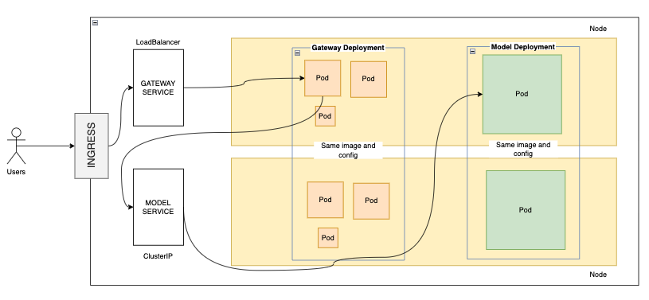
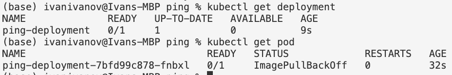
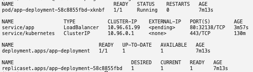
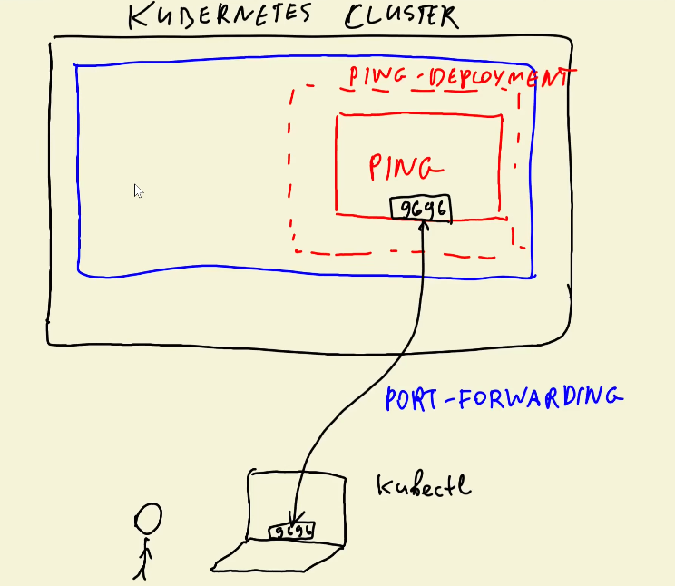

### Kubernetes intro

* Node ~ server/computer (i.e. EC2 instance)
* Pod ~ docker container, runs on a node
* Deployment ~ group of pods with the image & config
* Service ~ the entry point of an application, routes requests to pods
    - external = LoadBalancer
	- internal = ClusterIP
* Ingress ~ the entrypoint to the cluster
* HPA ~ Horizontal pod autoscaler - ensures the app scales up and down to match the required demand



* Ingress routes traffic to services within the cluster
* a sample request comes in from a user and is first sent to the LoadBalancer (the external-facing service), which balances the load of incoming requests across multiple Pods within the Gateway Deployment. This means the LoadBalancer routes the request to a Pod in the Gateway Deployment on any Node in the cluster (e.g., Node 1 or Node 2)
* from there, the Gateway Pod processes the request (e.g., handling authentication, routing, etc.) and forwards it to the internal Model Service
* the Model Service then assigns the request to one of the Pods in the Model Deployment, which may be running on a different Node within the cluster (e.g., Node 1 or Node 2)
* finally, once the Model Pod processes the request and generates a response, the response is sent back through the Gateway Pod and ultimately back to the user

The example in this repo and below only has 1 service and deployment. The above is used as a more complicated example to show routing

### Create k8s cluster

```
kind create cluster
```

- next, build and run our docker app

### Create deployment

- create deployment.yaml, and run

```
kubectl apply -f deployment.yaml
```



k8s does not know about the ping:v001 image, so we should register it first. Load it with

```
kind load docker-image ping:v001
``` 

The deployment keeps retrying to load the image, and once the image is loaded, we get

`ping-deployment-7bfd99c878-fnbxl   1/1     Running   0          4m32s`

when I run `kubectl get all`



#### Test the deployment



We can use port-forwarding:

We specify, the name of the pod, and then the port

```
kubectl port-forward app-deployment-58c8855fbd-xknbf 9696:9696
```

And I can use curl to test this:

```
curl -X POST http://localhost:9696/predict -H "Content-Type: application/json" -d '{"features": [5.1, 3.5, 1.4, 0.2]}'
```

And I get: `{"prediction":0}`  

### Create service.yaml

The service will forward requests to the pods. We as users will communicate with the service. 

Apply service:

```
kubectl apply -f service.yaml 
```

We can see it with `kubectl get svc`

```
NAME         TYPE           CLUSTER-IP     EXTERNAL-IP   PORT(S)        AGE
kubernetes   ClusterIP      10.96.0.1      <none>        443/TCP        29m
ping         LoadBalancer   10.96.94.146   <pending>     80:30966/TCP   2m15s
```

The EXTERNAL-IP is always pending unless we use some service like GKE and EKS


#### Test the k8s service

```
kubectl port-forward service/ping 8080:80 
```

Terminal:

```
Forwarding from 127.0.0.1:8080 -> 9696
Forwarding from [::1]:8080 -> 9696
```

And if I do (also change the port to 8080 now)

```
curl -X POST http://localhost:8080/predict -H "Content-Type: application/json" -d '{"features": [5.1, 3.5, 1.4, 0.2]}'
```

I get back: `{"prediction":0}` 


